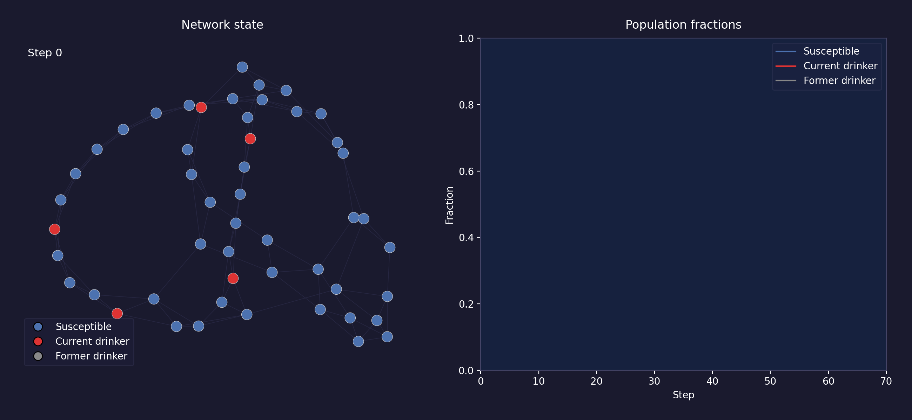

# Agent-Based Modelling of Drinking Behaviour

Group project for the Agent-Based Modelling course (UvA, June 2026).

We **replicate** the drinking-behaviour model of Gorman et al. (2006), agents
in three states (susceptible nondrinker `S`, current drinker `D`, former
drinker `R`) interacting on a one-dimensional lattice, and **extend** it from
spatial contagion to an explicit **social network**, where agents decide
whether to drink by playing a neighbourhood coordination game under bounded
rationality, risk and loss aversion, age-dependent susceptibility, and
habituation.

> **Research question.** How do bounded rationality, risk/loss aversion,
> age-dependent susceptibility, and social-network structure affect the
> emergence, persistence, and clustering of drinking behaviour, relative to
> the purely spatial contagion of the original lattice model?



*Each node is an agent (blue = susceptible, red = current drinker,
grey = former drinker); the right panel tracks the population fractions as
drinking spreads through the friendship network.*

## What the model does

**Baseline (`src/model.py`).** A faithful reimplementation of Gorman et al.
(2006). Agents on a 1-D lattice convert between `S`/`D`/`R` based on the
composition of their current site and perform a random walk; an optional bar
biases the movement of current drinkers. See the replication notes below.

**Extension (`src/network.py`).** Agents occupy nodes of a Watts–Strogatz
small-world network whose edges represent friendships. Each step a non-drinker
weighs the utility of drinking against abstaining as a coordination game:

```
ΔU = v(d_frac) − λ · v(1 − d_frac)        # loss-averse utility
P(drink) = 1 / (1 + exp(−ΔU / τ))         # logit / quantal-response choice
```

where `v` is a risk-averse (CRRA) value function with curvature `κ`, `λ` is the
loss-aversion coefficient, and `τ` is the rationality temperature (bounded
rationality). Initiation is scaled by an age-dependent susceptibility; the quit
rate decays with drinking tenure (habituation). The hard-threshold limit
`τ → 0` and Gorman's linear contagion (`κ = 0, λ = 1`) are both special cases.

## Setup

Requires Python 3.10+.

```bash
python -m venv .venv
source .venv/bin/activate      # Windows: .venv\Scripts\activate
pip install -r requirements.txt
```

## Running the model

**Baseline replication of Gorman et al. (2006)**, reproduce all four main
figures (S/D/R dynamics, the non-monotonic effect of motion, drinker
clustering around a bar, and the bar's buffering of susceptibles):

```bash
python experiments/run_replication.py
```

A single baseline run (configurable `p`, optional bar at site 7):

```bash
python experiments/run_baseline.py
python experiments/run_baseline.py --p-move 0.3 --bar-site 7
```

**Network extension**, every parameter is exposed on the CLI:

```bash
python experiments/run_network.py
python experiments/run_network.py --kappa-mean 0.5 --habituation-rate 0.2
python experiments/run_network.py --tau 0.1 --age-mean 17
```

**Animated visualisation** of the network model (shown above):

```bash
python experiments/visualise_network.py            # interactive window
python experiments/visualise_network.py --save     # write a GIF to results/figures/
```

**Sensitivity analysis** (OFAT parameter sweeps and Sobol first-/total-order
indices) is in `src/plot.ipynb`. Outputs (figures and time series) are written
to `results/`.

## Tests

```bash
pytest
```

Unit tests in `tests/` cover the transition rules, the decision-rule helpers,
parameter validation, population conservation, reproducibility, and that
habituation is a no-op when switched off.

## Replication notes

Figures 2–4 reproduce the qualitative behaviour of Gorman et al. (2006) and
approximately match the reported time scales: susceptible agents disappear in
the no-bar baseline, movement speed affects conversion non-monotonically, and
current drinkers cluster around the bar.

The bar mechanism is not fully specified in the paper. It states the bar is at
the "left edge", while the clustering peak in Figure 4 sits a few sites in, so
`run_replication.py` uses `BAR_SITE = 7`. Figure 5 reproduces qualitatively
(the bar buffers conversion, leaving a nonzero susceptible plateau) but our
plateau is higher than the paper's; under our implementation assumptions we
found no parameterization matching both the rapid early conversion and the low
plateau, which we attribute to underspecification of the bar in the original.

## Repository structure

```
src/
  model.py          Gorman et al. (2006) lattice baseline
  network.py        social-network extension (coordination game + biases)
  plot.ipynb        sensitivity analysis (OFAT sweeps, Sobol indices)
experiments/
  run_replication.py  reproduce the four Gorman figures
  run_baseline.py     single configurable lattice run
  run_network.py      single configurable network run
  visualise_network.py animated network visualisation
tests/              pytest unit tests for both models
results/figures/    generated figures and the demo animation
docs/               submitted proposal and tutor feedback
```

## Attribution

All model and analysis code in this repository is written by the project group.
Third-party libraries are listed in `requirements.txt`; the small-world graph
is generated with NetworkX's `watts_strogatz_graph`. Reused or adapted code, if
any, is marked in the file where it appears.

## References

- Gorman, D. M., Mezic, J., Mezic, I., & Gruenewald, P. J. (2006). Agent-based
  modeling of drinking behavior: a preliminary model and potential applications
  to theory and practice. *American Journal of Public Health*, 96(11),
  2055–2060.
- Müller, B., et al. (2013). Describing human decisions in agent-based models –
  ODD+D, an extension of the ODD protocol. *Environmental Modelling & Software*,
  48, 37–48.
- Watts, D. J., & Strogatz, S. H. (1998). Collective dynamics of 'small-world'
  networks. *Nature*, 393, 440–442.
- Kahneman, D., & Tversky, A. (1979). Prospect theory: an analysis of decision
  under risk. *Econometrica*, 47(2), 263–291.
- McKelvey, R. D., & Palfrey, T. R. (1995). Quantal response equilibria for
  normal form games. *Games and Economic Behavior*, 10(1), 6–38.
